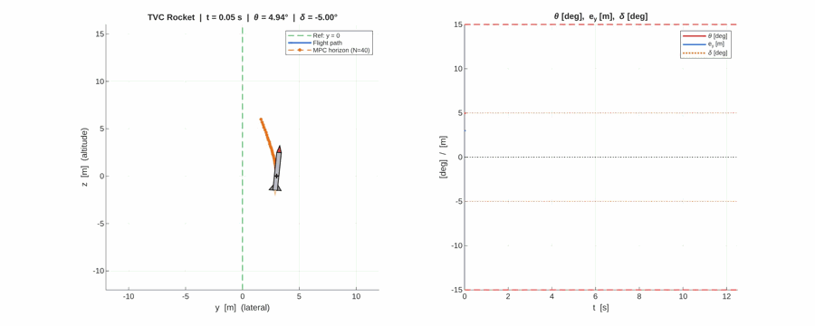
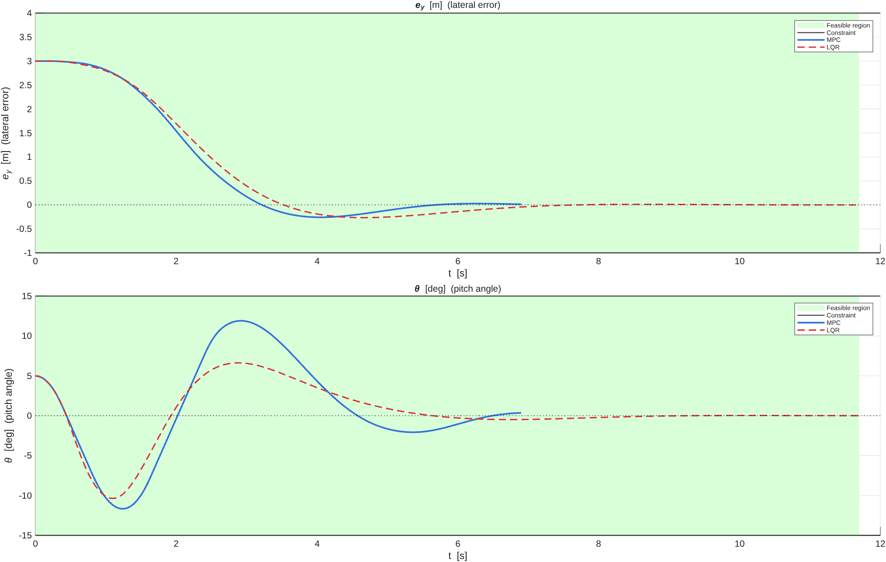
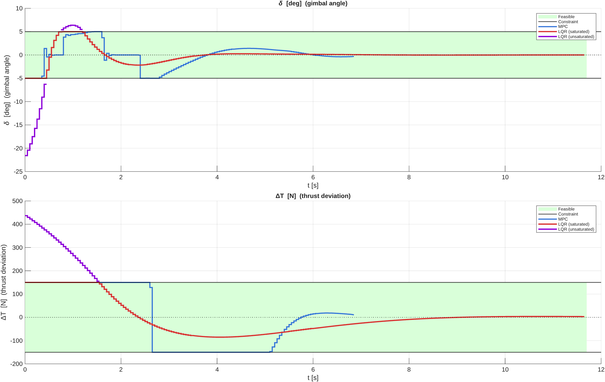
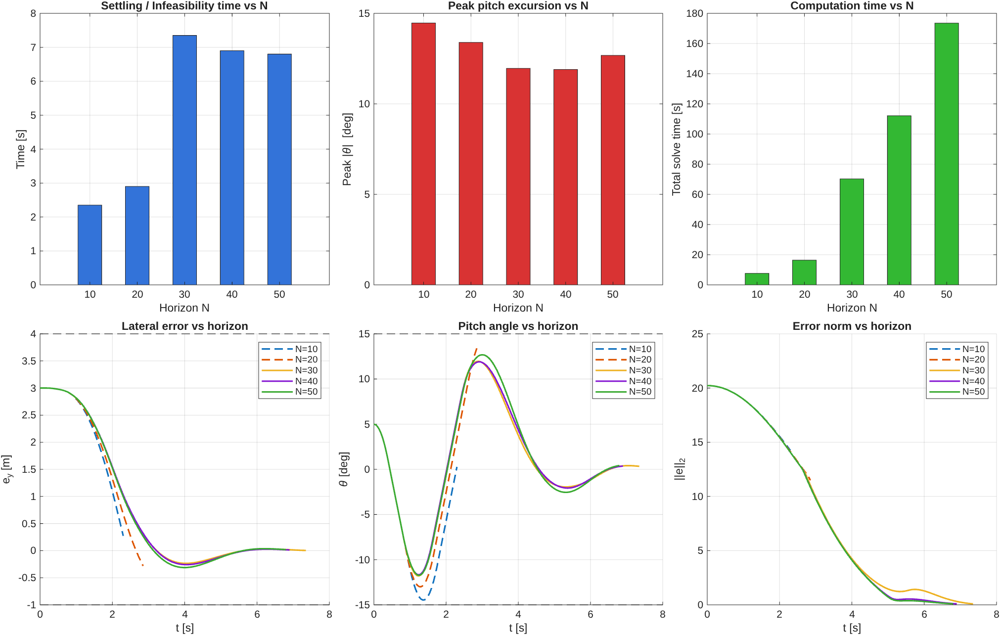
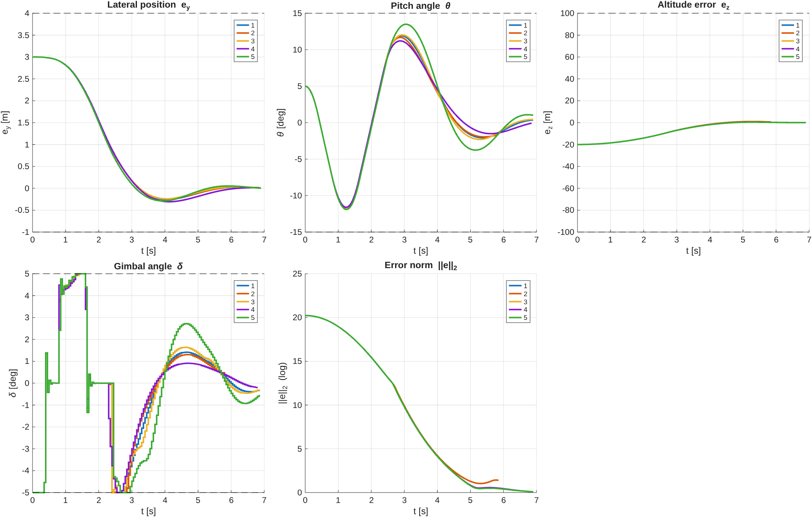
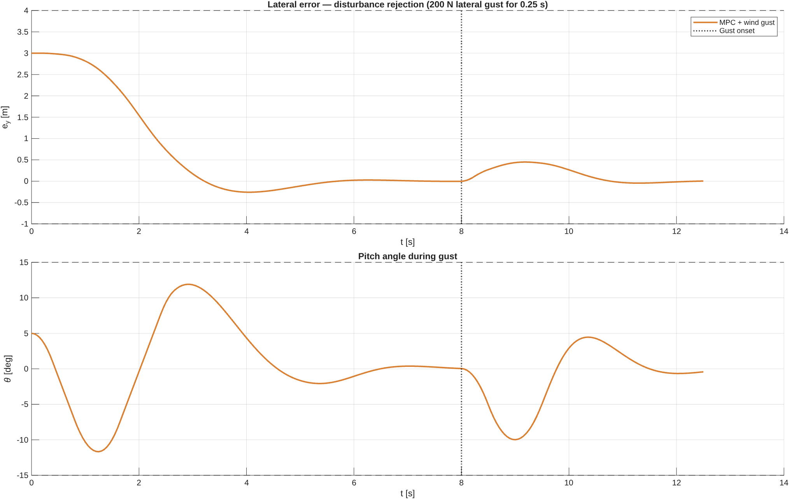
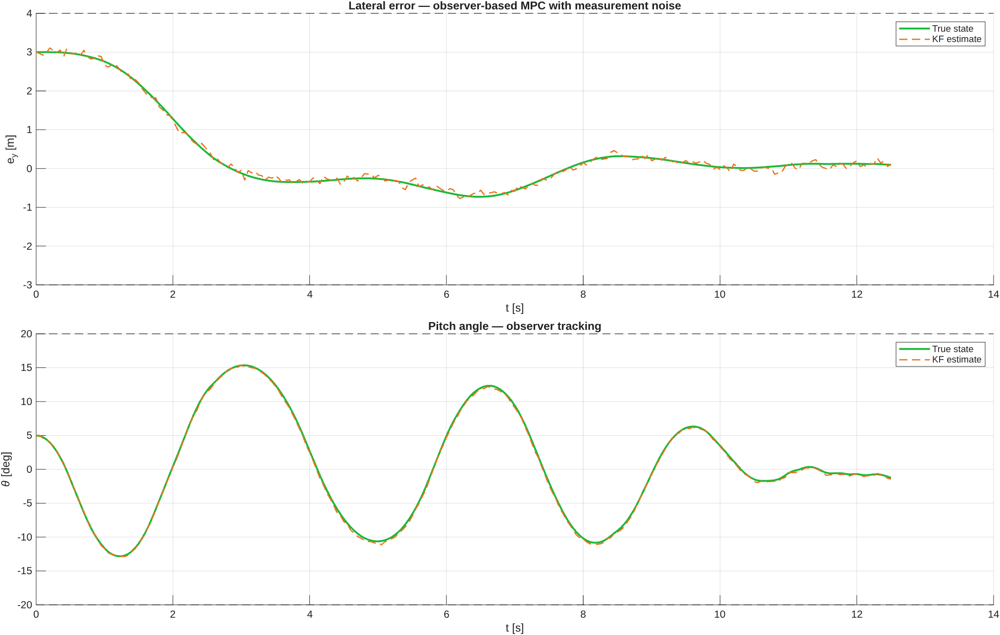

# TVC MPC — Thrust Vector Control with Model Predictive Control

Constrained model predictive control for a gimballed rocket in 2-D, benchmarked against LQR,
written in MATLAB with [YALMIP](https://yalmip.github.io/).



The left panel is the rocket in the $(y, z)$ plane — blue is the path flown, orange is the
trajectory the controller is predicting over its horizon at that instant. The right panel tracks
pitch, lateral error and gimbal deflection against their limits.

---

## The problem

A 50 kg rocket starts **3 m off-axis**, **20 m below** its hover target, and **pitched 5°**. It has
to fly to the hover point and hold it, using two weak actuators: a nozzle gimbal limited to **±5°**
and a throttle that can trim only **±150 N** around the nominal hover thrust.

The difficulty is that thrust vectoring is indirect authority. The engine can only push along the
body axis, so to move sideways the rocket must first tip — and tipping is itself limited, both by
the ±5° gimbal that generates the torque and by a ±15° pitch bound that keeps the small-angle
linearisation honest. Every lateral correction has to be bought through attitude, paid for in
advance, and then unwound before arrival.

| Parameter | Symbol | Value |
|---|---|---|
| Mass | $m$ | 50 kg |
| Inertia about CG | $J$ | 80 kg·m² |
| CG to gimbal pivot | $\ell_{tvc}$ | 1.3 m |
| Nominal thrust | $T_0 = mg$ | 490.5 N |
| Sample period | $T_s$ | 0.05 s (20 Hz) |
| Prediction horizon | $N$ | 40 steps (2 s) |

---

## Headline result

Both controllers stabilise the rocket. The difference is that **only one of them asks for something
the hardware can actually do.**

| | MPC | LQR |
|---|---|---|
| Settling time | **6.90 s** | 11.70 s |
| Peak pitch | 11.90° | 10.38° |
| Peak *commanded* gimbal | 5.00° — at the limit | **21.58° — 4.3× over** |
| Peak *commanded* thrust trim | 150 N — at the limit | **436.8 N — 2.9× over** |
| Time spent commanding an impossible gimbal | 0 s | 0.90 s |
| Time spent commanding an impossible thrust | 0 s | 1.55 s |

The LQR baseline is an unconstrained infinite-horizon gain whose command is saturated at the
actuator limits before it reaches the plant — the standard way this is done in practice. It opens
by demanding **21.6° of deflection from a gimbal that stops at 5°**, and 437 N of trim from a
throttle that stops at 150 N. Those commands are not tracked, they are clipped. The controller is
never told, keeps integrating against a plant that is not responding as modelled, and takes
**70% longer** to settle as a result.

MPC has the same actuators and the same model. It simply refuses to plan a trajectory it cannot
fly: the limits are constraints in the optimisation, so every command it emits is feasible by
construction. It still saturates — the gimbal sits hard against −5° between roughly 2.4 s and 2.8 s
and the throttle rides its lower limit from 2.6 s to 5 s — but it *chooses* to sit on the limit,
having planned the whole approach around it.





The purple traces are the LQR command before saturation. Everything outside the green band is
authority the vehicle does not have.

> Worth being precise about one thing: the state constraint set below includes a lateral corridor
> of $e_y \in [-1, 4]$ m, and in this scenario **neither controller comes close to it** — the worst
> undershoot is about −0.27 m. The binding constraints here are the actuator limits and, at short
> horizons, the pitch rate. The corridor is carried in the formulation but is not what separates the
> two controllers.

---

## Model

State $x = [y,\ z,\ v_y,\ v_z,\ \theta,\ q]^\top$, input $u = [\delta,\ \Delta T]^\top$ where
$\delta$ is gimbal deflection and $\Delta T$ is thrust trim. With $T = T_0 + \Delta T$, the
nonlinear equations of motion (`tvc_ode.m`) are

$$
\dot{y} = v_y, \qquad
\dot{z} = v_z, \qquad
\dot{v}_y = \frac{T \sin(\theta + \delta)}{m},
$$

$$
\dot{v}_z = \frac{T \cos(\theta + \delta)}{m} - g, \qquad
\dot{\theta} = q, \qquad
\dot{q} = \frac{T \ell_{tvc} \sin\delta}{J}.
$$

The thrust vector is tilted by $\theta + \delta$ — body attitude plus gimbal — which is what couples
attitude into translation.

Linearising about hover ($\theta = \delta = 0$, $T = T_0$) in error coordinates $e = x - x_\text{ref}$
under the small-angle approximation gives

$$
A_c = \begin{bmatrix}
0&0&1&0&0&0\\
0&0&0&1&0&0\\
0&0&0&0&g&0\\
0&0&0&0&0&0\\
0&0&0&0&0&1\\
0&0&0&0&0&0
\end{bmatrix},
\qquad
B_c = \begin{bmatrix}
0&0\\ 0&0\\ g&0\\ 0&1/m\\ 0&0\\ T_0\ell_{tvc}/J&0
\end{bmatrix},
$$

discretised with a zero-order hold at 20 Hz. The pair is controllable (rank 6). Every continuous-time
eigenvalue sits at the origin — the open loop is a chain of integrators, marginally stable, and will
not recover on its own.

The **prediction model is this linearisation, but the simulated plant is not.** Every closed-loop step
integrates the full nonlinear equations with RK4 (`tvc_nonlinear_step.m`), so all results include the
model mismatch the controller has to reject.

---

## Controller

At each step the controller solves this QP over the horizon and applies only $u_0^\star$:

$$
\min_{U}\ \ \beta\, e_N^\top P e_N + \sum_{k=0}^{N-1} \left( e_k^\top Q e_k + u_k^\top R u_k \right)
$$

$$
\text{s.t.}\quad
e_{k+1} = A_d e_k + B_d u_k, \quad
e_0 = \hat{e}(t), \quad
e_{lb} \le e_k \le e_{ub}, \quad
u_{lb} \le u_k \le u_{ub}.
$$

The terminal weight $P$ solves the discrete algebraic Riccati equation for $(A_d, B_d, Q, R)$, scaled
by $\beta = 3$. Pricing the tail at its infinite-horizon optimal cost instead of truncating it is what
buys stability from a finite horizon; $\beta > 1$ over-weights it slightly to strengthen the terminal
pull.

| | $e_y$ | $e_z$ | $e_{v_y}$ | $e_{v_z}$ | $\theta$ | $q$ |
|---|---|---|---|---|---|---|
| $Q$ | 50 | 500 | 10 | 50 | 200 | 20 |
| lower | −1 m | −100 m | −30 m/s | −30 m/s | −15° | −20°/s |
| upper | +4 m | +100 m | +30 m/s | +30 m/s | +15° | +20°/s |

| | $\delta$ | $\Delta T$ |
|---|---|---|
| $R$ | 50 | 0.01 |
| limits | ±5° | ±150 N |

The ±15° pitch bound is not hardware — it keeps the state inside the region where the small-angle
linearisation is a fair description of the real dynamics.

---

## Studies

### Horizon length

There is a hard feasibility cliff between N=20 and N=30.

| $N$ | Outcome | Peak \|θ\| | Wall clock | Per step |
|---|---|---|---|---|
| 10 | **infeasible** at 2.35 s | 14.47° | 7.4 s | 0.16 s |
| 20 | **infeasible** at 2.90 s | 13.39° | 14.5 s | 0.25 s |
| 30 | settled 7.35 s | 11.96° | 64.8 s | 0.44 s |
| 40 | settled 6.90 s | 11.90° | 115.1 s | 0.83 s |
| 50 | settled 6.80 s | 12.68° | 177.4 s | 1.30 s |

With a horizon under one second the controller cannot see far enough ahead to unwind the attitude it
builds up, drives the pitch rate into its ±20°/s bound, and the QP becomes infeasible with no
recovery. Past N=30 the settling time is essentially flat (7.35 → 6.80 s) while cost per step triples,
which is what makes N=40 a defensible default.



> These are wall-clock times for the whole closed-loop run, not per-QP solve times — `solve_mpc_tvc.m`
> rebuilds and re-parses the YALMIP model every step, and that dominates. At 0.83 s per step against a
> 0.05 s sample period, this implementation is **~17× short of real time**. It is a design and analysis
> tool, not a flight-ready controller. Building the QP once with YALMIP's `optimizer()` would close most
> of that gap.

### Cost weights

Five tunings, varying altitude weight, gimbal penalty and pitch weight around the nominal.

| Case | Change from nominal | Outcome | Peak \|θ\| | Gimbal sat. | Thrust sat. |
|---|---|---|---|---|---|
| 1 | nominal | settled 6.90 s | 11.90° | 20 | 101 |
| 2 | $Q_{e_z}$ ×4 | **infeasible** at 5.90 s | 11.69° | 21 | 112 |
| 3 | $R_\delta$ ÷10 | settled 6.90 s | 12.02° | 18 | 101 |
| 4 | $R_\delta$ ×10 | settled 6.85 s | 11.61° | 16 | 102 |
| 5 | $Q_\theta$ ÷10 | settled 6.90 s | 13.49° | 19 | 101 |

Settling time is remarkably insensitive to the gimbal penalty — a 100× swing in $R_\delta$ (cases 3
and 4) moves it by 50 ms, because the binding limit is the actuator, not the weight. Pushing the
altitude weight up (case 2) is the one change that breaks it: chasing altitude harder drives the
throttle into saturation for more of the run and the problem goes infeasible.



### Disturbance rejection

A 200 N lateral gust is applied for 0.25 s at t = 8 s, after the vehicle has settled.



### Output feedback with a Kalman filter

The controller is given only noisy measurements of $[e_y,\ e_z,\ \theta,\ q]$ — GPS at ±0.10 m,
IMU at ±0.10° and ±0.5°/s. The state is reconstructed by a steady-state Kalman filter on a model
augmented with one extra state: a **constant pitch-measurement bias**, so the estimator can separate
a drifting IMU from genuine attitude. The augmented pair is observable (rank 7) and the observer is
stable (max \|eig\| = 0.995).

Convergence takes 12.50 s against 6.90 s with perfect state feedback, and the attitude oscillation is
visibly larger — the controller is now reacting to estimator error as well as to the plant. Because of
that, this run is given a deliberately **relaxed constraint set** (±20° pitch, ±25°/s rate, lateral
lower bound −3 m); with the nominal bounds the noise pushes the QP infeasible. Peak true pitch reaches
15.4° against that 20° bound. The figure below draws the relaxed limits, i.e. the ones actually
enforced.



---

## Repository layout

| File | Purpose |
|---|---|
| `main_tvc_mpc.m` | Entry point — builds the model, runs every study, writes figures |
| `solve_mpc_tvc.m` | Builds and solves the horizon QP in YALMIP |
| `run_mpc_sim.m` | Closed-loop simulation driver (optional Kalman filter, gust, animation) |
| `tvc_ode.m` | Nonlinear 2-D equations of motion |
| `tvc_nonlinear_step.m` | RK4 integration of one sample period |
| `draw_tvc_frame.m` | Renders one animation frame |
| `plot_results_tvc.m` | MPC-vs-LQR summary figures |
| `save_figures_tvc.m` | Report-quality figures (run after `main_tvc_mpc`) |
| `save_figure.m` | Figure export helper — vector PDF + PNG |
| `tools/make_gif.m` | Transcodes the animation AVI to the GIF above |

---

## Requirements

- MATLAB R2020a or later
- Control System Toolbox — `c2d`, `dare`, `ctrb`, `obsv`, `dlqe`
- Optimization Toolbox — `quadprog`
- [YALMIP](https://yalmip.github.io/download/) on the MATLAB path

`solve_mpc_tvc.m` uses `quadprog` when available and otherwise lets YALMIP select any QP solver you
have installed, so the Optimization Toolbox is a convenience rather than a hard requirement.
`tools/make_gif.m` additionally needs the Image Processing Toolbox, but only if you are regenerating
the animation.

## Running

```matlab
main_tvc_mpc     % all simulations and studies — allow ~20 minutes
save_figures_tvc % report figures, uses the workspace left by the line above
```

Set `live_animation = false` at the top of `main_tvc_mpc.m` to skip the on-screen animation. Figures
are written twice: vector PDFs into `report/figures/` and PNGs into `assets/`.

## License

[Apache 2.0](LICENSE)
